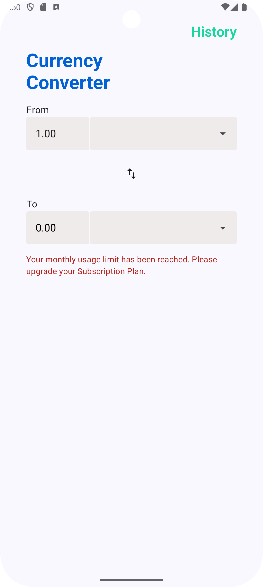

# Currency Converter App

A modern Android currency converter application built with Kotlin and Jetpack Compose, following Clean Architecture principles and best practices.

## Features

- Real-time currency conversion
- Support for multiple currencies
- Historical exchange rates
- Clean and intuitive UI with Material Design 3
- Unit tests coverage

- ## Screenshots & Demo

<div align="center">
  
  
  
  
</div>

### Demo Video

<div align="center">
  <video width="250" controls>
    <source src="screenshots/demo.mp4" type="video/mp4">
    Your browser does not support the video tag.
  </video>
</div>

## Architecture

The app follows Clean Architecture principles and is organized into the following layers:

- **Presentation Layer**: Contains UI components (Compose), ViewModels, and UI states
- **Domain Layer**: Contains business logic, use cases, and repository interfaces
- **Data Layer**: Implements repositories and manages data sources

### Tech Stack

- **Kotlin**: Primary programming language
- **Jetpack Compose**: Modern UI toolkit
- **Coroutines & Flow**: Asynchronous programming
- **Hilt**: Dependency injection
- **Retrofit**: Network requests
- **Material Design 3**: UI components and styling
- **Unit Testing**: JUnit, Mockk

## Project Structure

```
app/
├── core/
│   ├── di/
│   └── utils/
├── data/
│   ├── api/  
│   │   └── FixerApi.kt
│   ├── dto/
│   └── repository/
├── domain/
│   ├── model/
│   ├── repository/
│   └── usecase/
├── presentation/
│   ├── converter/
│   ├── history/
│   └── navigation/
└── 
```

## Getting Started

### Prerequisites

- Android Studio Arctic Fox or later
- JDK 11 or later
- Android SDK with minimum API level 24

### Setup

1. Clone the repository:
```bash
git clone https://github.com/Ahmed-P-Mostafa/Currency.git
```

2. Open the project in Android Studio

3. Add your Fixer API key in `NetworkModule.kt`:
```kotlin
.addQueryParameter("access_key", "YOUR_API_KEY")
```

4. Build and run the project

## Testing

The project includes comprehensive unit tests for:
- ViewModels
- Use Cases
- Repositories
- Utility Functions

Run tests using:
```bash
./gradlew test
```

## Architecture Components

### ViewModel
- Manages UI state and business logic
- Handles currency conversion and data fetching
- Implements error handling and loading states

### Use Cases
- GetCurrenciesUseCase: Fetches available currencies
- GetExchangeRateUseCase: Calculates exchange rates
- GetHistoricalRatesUseCase: Retrieves historical data

### Repository
Implements data operations with:
- API integration
- Error handling
- Data mapping

## Contributing

1. Fork the repository
2. Create your feature branch (`git checkout -b feature/AmazingFeature`)
3. Commit your changes (`git commit -m 'Add some AmazingFeature'`)
4. Push to the branch (`git push origin feature/AmazingFeature`)
5. Open a Pull Request

## License

This project is licensed under the MIT License - see the [LICENSE](LICENSE) file for details.

## Acknowledgments

- [Fixer.io](https://fixer.io/) for exchange rate data
- Material Design 3 for UI components
- Android Jetpack libraries
